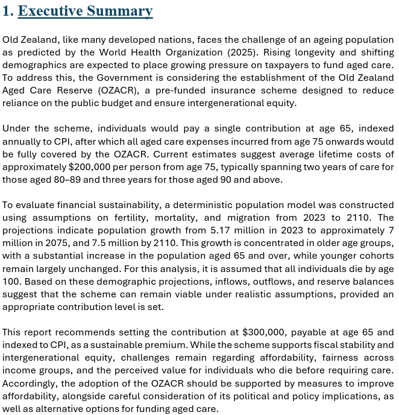
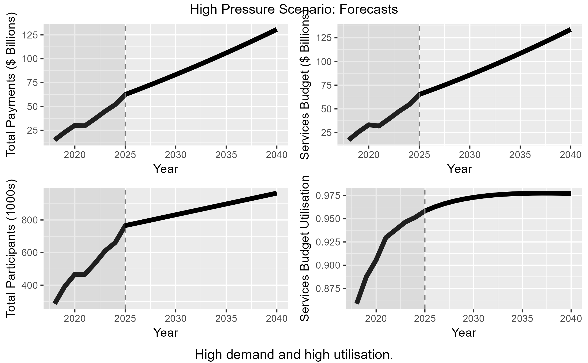

# Actuarial & Risk Modelling

Projects involving forecasting, insurance, demographics and long-term risk analysis.

---

# Portfolio Page Links
- 🏠 [Home](index) - Home page and "about me" information.
- ⭐ [Featured Projects](featured) - My strongest end-to-end analytics projects (sports predictive modelling pipeline, retirement forecasting report)
- 🏛 [Government Analytics](government) - Public sector reporting and government datasets (government data Power BI reports)
- 📊 [Data Science](ml) - Machine learning (ML), predictive modelling and forecasting (end-to-end ML apps and reports)
- 📈 [**Actuarial Modelling**](actuarial) - Insurance, retirement, demographic and risk modelling (insurance and policy actuarial analysis)

---

# New Zealand Aged Care Insurance Scheme (Group University Project)
A long-term demographic and financial projection assessing the financial suitability of a government-proposed Aged Care Insurance Scheme using New Zealand data.

Tools:
R | Excel | MS Word | MS PowerPoint

Key Outcomes:
- Developed long-term demographic and financial projections using mortality, fertility, migration, and insurance data. 
- Built actuarial models to assess the solvency and sustainability of a proposed government insurance scheme. 
- Evaluated policy outcomes under alternative assumptions through scenario analysis. 
- Delivered evidence-based recommendations and communicated findings to a non-technical audience.

📷 Executive Summary: 

---

# NDIS Scheme Cost Growth and Fiscal Risk Report
A written report, analysing the medium-term fiscal sustainability of the Australian National Disability Insurance Scheme, using demographic and economic modelling.

Tools:
R | MS Word

Key Outcomes:
- Assessed long-term fiscal sustainability risks associated with a major government expenditure program.
- Applied demographic and economic modelling techniques to quantify future cost pressures. 
- Evaluated financial risks under varying assumptions and policy environments. 
- Produced a written report translating technical analysis into policy-relevant insights.

📷 Scenario Analysis: 

👉 View the full project here: [NDIS Report](https://github.com/jack-galileo04/NDIS-report)

---

# 🚗 Motor Vehicle Insurance Pricing Model
End-to-end machine learning project, with exploratory data analysis and regression techniques to price motor vehicle insurance policies.

Tools:
R

Key Outcomes:
- Built an end-to-end insurance pricing framework covering approximately 50,000 policies. 
- Applied frequency-severity modelling using Negative Binomial and Gamma Generalised Linear Models. 
- Conducted diagnostic testing and model validation to assess pricing stability and fit. 
- Generated risk-based premiums and portfolio-level pricing recommendations aligned to target loss ratios.

👉 View the full project here: [Motor Insurance Pricing Model](https://github.com/jack-galileo04/Motor-Insurance-Pricing)

---

# 💼 General Insurance Pricing Model
End-to-end actuarial pricing project, with concise exploratory data analysis, GLM modelling of claim frequency and severity, and segment analysis on loss ratios.

Tools:
R

Key Outcomes:
- Performed actuarial pricing analysis using claim frequency and severity modelling techniques. 
- Applied Generalised Linear Models to estimate risk-adjusted premium structures. 
- Identified profitability drivers through segment and loss-ratio analysis. 
- Produced pricing recommendations supported by quantitative evidence and statistical modelling.

👉 View the full project here: [GI Pricing Model](https://github.com/jack-galileo04/GI-Pricing-Model)
