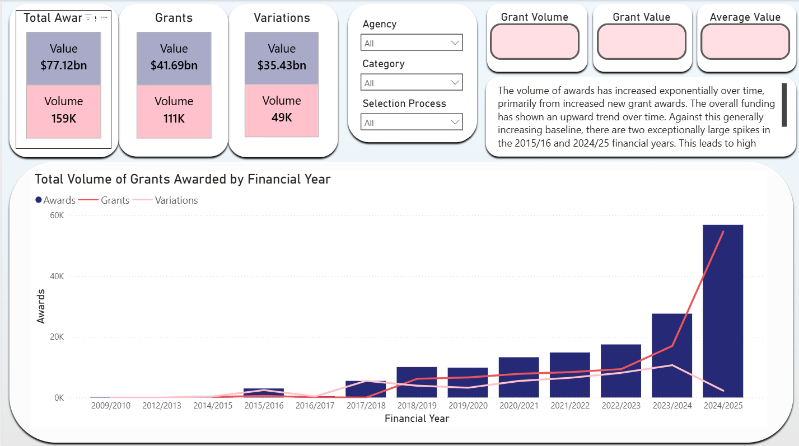
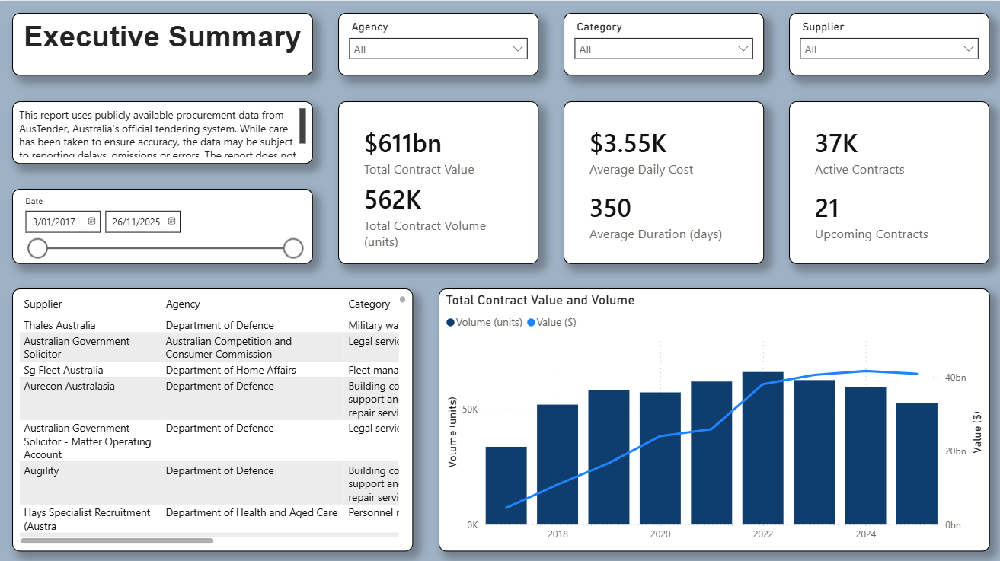

# Government Data Analytics

Projects focused on public-sector datasets and analytics, reporting and evidence-based decision-making.

---

# Portfolio Page Links
- 🏠 [Home](index) - Home page and "about me" information.
- ⭐ [Featured Projects](featured) - My strongest end-to-end analytics projects.
- 🏛 [**Government Analytics**](government) - Public sector reporting and government datasets.
- 📊 [Data Science](ml) - Machine learning, predictive modelling and forecasting.
- 📈 [Actuarial Modelling](actuarial) - Insurance, retirement, demographic and risk modelling.

---

### Government Grants Report
An interactive report visualising Australian Government Grants insights, incorporating time series analysis, concentration risk assurance, and distribution across various parameters.

Tools:
Power BI | SQL

Key Outcomes:
- Applied SQL, Power Query, and DAX techniques to transform raw data into decision-ready insights. 
- Analysed funding distribution patterns, trends, and concentration risks across grant programs. 
- Demonstrated practical use of government data to support transparency and evidence-based decision-making.

👉 View the full project here: [Government Grants Project](https://github.com/jack-galileo04/government_grants-report)

👉 View the report here: [Government Grants Report](https://app.powerbi.com/view?r=eyJrIjoiOWJjY2I1MmQtYTA3Yi00MDgyLThkYzYtMWNjMDgzMjk1NDkyIiwidCI6IjNhYTEyYWIxLWQyNGEtNGI0Yy04YjI0LTk5ZWI3ODE2YzJjZSJ9&pageName=ade89b2574cee15b2704)

📷 Dashboard Preview: 

---

### AusTender Contracts Report
An interactive report visualising Australian contract insights using time series and snapshot data across suppliers, agencies, and categories.

Tools:
SQL | Excel | Power BI

Key Outcomes:
- Developed a reporting solution analysing Australian Government procurement and contract activity.
- Created interactive dashboards allowing exploration of suppliers, agencies, spending categories, and trends.
- Applied data modelling and visualisation techniques to improve accessibility of public procurement information.
- Enabled identification of spending patterns and contract concentration across government entities.

👉 View the full project here: [AusTender Project](https://github.com/jack-galileo04/austender-report)

👉 View the report here: [AusTender Report](https://app.powerbi.com/view?r=eyJrIjoiNjhhZGM1ZjktN2U2Ni00OGQ0LThhYzItNTk3OGUzYjM4MjM5IiwidCI6IjNhYTEyYWIxLWQyNGEtNGI0Yy04YjI0LTk5ZWI3ODE2YzJjZSJ9&pageName=b31bb2a99dd0f4653f90)

📷 Dashboard Preview: 
