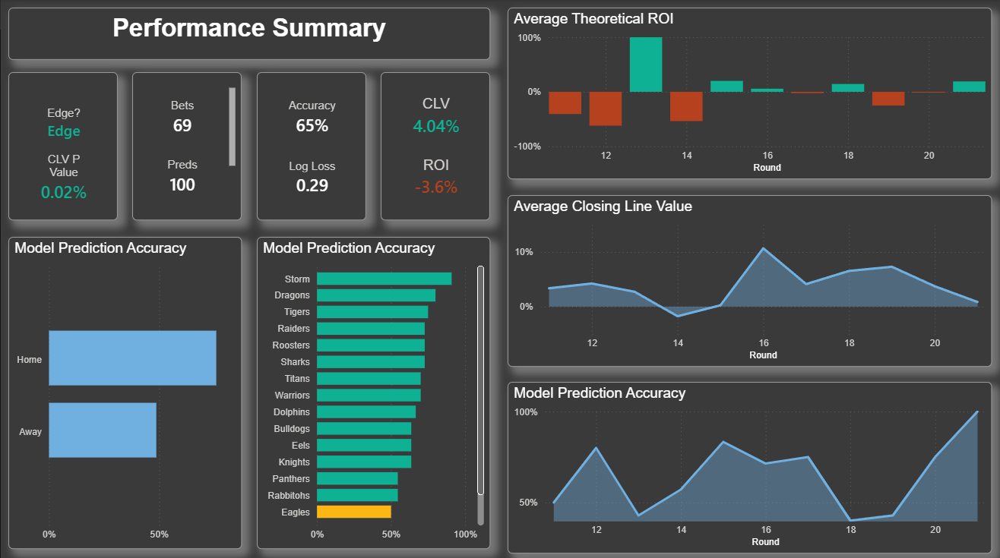
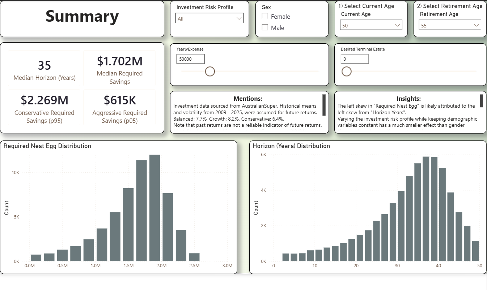
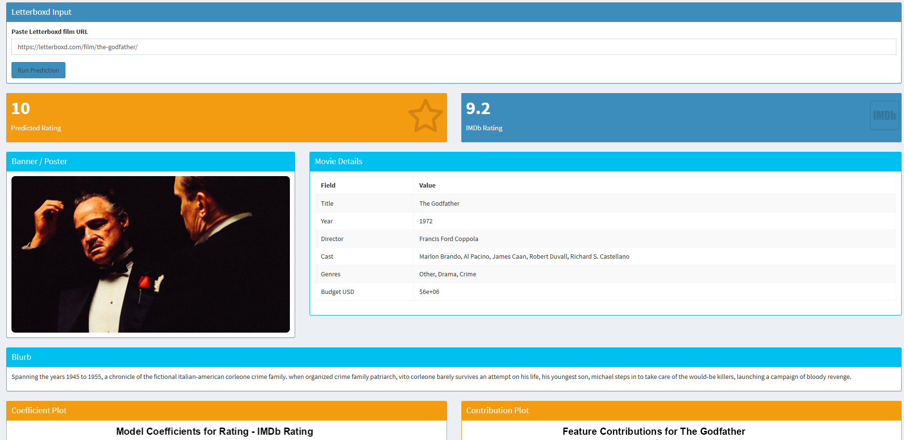

# Jack Galea — Data & Analytics Portfolio

- Based in Canberra, ACT
- email: jackg04@outlook.com.au
[GitHub](https://github.com/jack-galileo04) | [LinkedIn](www.linkedin.com/in/jackgalea)
---
## About Me:

I recently completed a degree in Actuarial Studies at the
Australian National University.

I enjoy applying statistical and analytical techniques to
real-world problems, particularly where uncertainty,
forecasting, risk, and decision-making are involved.

Skilled in Python, R, SQL, Power BI and modern analytics workflows.
Interested in applying quantitative methods to public policy,
health, finance, and operational challenges.

Outside of analytics, I enjoy movies, music and following/playing sports.

---
## Project Statistics: 

- Projects: 10+
- Tools: Python, R, SQL, Power BI, Excel
- Dashboards: 5+
- Machine Learning (ML) Models: 6+
- Government Data Projects: 3+

---

# Featured Project

### 🏆 NRL Match Predictive Data Pipeline
A reproducible, end-to-end predictive modelling and data pipeline forming National Rugby League match predictions with team and player-level data granularity. 

Tools:
R {targets} | SQL | Excel | Power BI

Key Outcomes:
- Designed and automated an end-to-end analytics workflow integrating APIs, web-scraped data, SQL storage, ML models, and Power BI reporting. 
- Improved reliability and reproducibility through pipeline orchestration, validation checks, and structured data management. 
- Produced calibrated match probability forecasts using player-level and team-level modelling techniques. 
- Developed performance-monitoring dashboards to track prediction accuracy, calibration, and long-term model effectiveness.

👉 View the full project repo here: [NRL Model](https://github.com/jack-galileo04/nrl-model)

📷 Dashboard Preview: 

---

# Government Data Analytics

### Government Grants Report
An interactive report visualising Australian Government Grants insights, incorporating time series analysis, concentration risk assurance, and distribution across various parameters.

Tools:
Power BI | SQL

Key Outcomes:
- Applied SQL, Power Query, and DAX techniques to transform raw data into decision-ready insights. 
- Analysed funding distribution patterns, trends, and concentration risks across grant programs. 
- Demonstrated practical use of government data to support transparency and evidence-based decision-making.

👉 View the full project here: [Government Grants Project](https://github.com/jack-galileo04/government_grants-report)

👉 View the report here: [Government Grants Report](https://app.powerbi.com/view?r=eyJrIjoiOWJjY2I1MmQtYTA3Yi00MDgyLThkYzYtMWNjMDgzMjk1NDkyIiwidCI6IjNhYTEyYWIxLWQyNGEtNGI0Yy04YjI0LTk5ZWI3ODE2YzJjZSJ9&pageName=ade89b2574cee15b2704)

📷 Dashboard Preview: 

---

### AusTender Contracts Report
An interactive report visualising Australian contract insights using time series and snapshot data across suppliers, agencies, and categories.

Tools:
SQL | Excel | Power BI

Key Outcomes:
- Developed a reporting solution analysing Australian Government procurement and contract activity.
- Created interactive dashboards allowing exploration of suppliers, agencies, spending categories, and trends.
- Applied data modelling and visualisation techniques to improve accessibility of public procurement information.
- Enabled identification of spending patterns and contract concentration across government entities.

👉 View the full project here: [AusTender Project](https://github.com/jack-galileo04/austender-report)

👉 View the report here: [AusTender Report](https://app.powerbi.com/view?r=eyJrIjoiNjhhZGM1ZjktN2U2Ni00OGQ0LThhYzItNTk3OGUzYjM4MjM5IiwidCI6IjNhYTEyYWIxLWQyNGEtNGI0Yy04YjI0LTk5ZWI3ODE2YzJjZSJ9&pageName=b31bb2a99dd0f4653f90)

📷 Dashboard Preview: 

---

# Actuarial & Risk Modelling

### 💰 Retirement Savings Modelling Report
A personalised retirement forecasting solution using demographic, economic, and mortality modelling techniques.

Tools:
R | SQL | Power BI

Key Outcomes:
- Used economic and demographic data to build time series models and form defensible assumptions.
- Generated millions of simulation outcomes through Monte Carlo methods to quantify uncertainty and retirement risk.
- Delivered interactive Power BI reporting to support scenario analysis and evidence-based financial planning.
- Communicated complex probabilistic outcomes through intuitive visualisations and decision-focused insights

👉 View the full project here: [Retirement Savings Repo](https://github.com/jack-galileo04/retirement-report)

👉 View the report here: [Retirement Savings Report](https://app.powerbi.com/view?r=eyJrIjoiNDgyMGQ5YzEtNWI4Mi00ZDhlLThiMGMtOWJkMzZlYTc3NzAyIiwidCI6IjNhYTEyYWIxLWQyNGEtNGI0Yy04YjI0LTk5ZWI3ODE2YzJjZSJ9&pageName=fd5649d8ab8b02bfb164)

📷 Dashboard Preview: 

---

### New Zealand Aged Care Insurance Scheme (Group University Project)
A long-term demographic and financial projection assessing the financial suitability of a government-proposed Aged Care Insurance Scheme using New Zealand data.

Tools:
R | Excel | MS Word | MS PowerPoint

Key Outcomes:
- Developed long-term demographic and financial projections using mortality, fertility, migration, and insurance data. 
- Built actuarial models to assess solvency and sustainability of a proposed government insurance scheme. 
- Evaluated policy outcomes under alternative assumptions through scenario analysis. 
- Delivered evidence-based recommendations and communicated findings to a non-technical audience.

---

### NDIS Scheme Cost Growth and Fiscal Risk Report
A written report, analysing the medium-term fiscal sustainability of the Australian National Disability Insurance Scheme, using demographic and economic modelling.

Tools:
R | MS Word

Key Outcomes:
- Assessed long-term fiscal sustainability risks associated with a major government expenditure program.
- Applied demographic and economic modelling techniques to quantify future cost pressures. 
- Evaluated financial risks under varying assumptions and policy environments. 
- Produced a written report translating technical analysis into policy-relevant insights.

👉 View the full project here: [NDIS Report](https://github.com/jack-galileo04/NDIS-report)

---

### 🚗 Motor Vehicle Insurance Pricing Model
End-to-end machine learning project, with exploratory data analysis and regression techniques to price motor vehicle insurance policies.

Tools:
R

Key Outcomes:
- Built an end-to-end insurance pricing framework covering approximately 50,000 policies. 
- Applied frequency-severity modelling using Negative Binomial and Gamma Generalised Linear Models. 
- Conducted diagnostic testing and model validation to assess pricing stability and fit. 
- Generated risk-based premiums and portfolio-level pricing recommendations aligned to target loss ratios.

👉 View the full project here: [Motor Insurance Pricing Model](https://github.com/jack-galileo04/Motor-Insurance-Pricing)

---

### 💼 General Insurance Pricing Model
End-to-end actuarial pricing project, with concise exploratory data analysis, GLM modelling of claim frequency and severity, and segment analysis on loss ratios.

Tools:
R

Key Outcomes:
- Performed actuarial pricing analysis using claim frequency and severity modelling techniques. 
- Applied Generalised Linear Models to estimate risk-adjusted premium structures. 
- Identified profitability drivers through segment and loss-ratio analysis. 
- Produced pricing recommendations supported by quantitative evidence and statistical modelling.

👉 View the full project here: [GI Pricing Model](https://github.com/jack-galileo04/GI-Pricing-Model)

---

# Data Science & ML

### 🎬 Letterboxd Movie Ratings Prediction & Shiny Dashboard
End-to-end predictive modelling workflow exploring my personal movie rating behaviour by combining data from Letterboxd and IMDb, leveraging data scraping, NLP techniques, and ML modelling frameworks.

Tools:
R

Key Outcomes:
- Combined multiple external datasets through web scraping and data integration to create a unified analytical dataset.
- Applied feature engineering and natural language processing techniques to improve predictive performance. 
- Evaluated machine learning models using nested cross-validation to ensure robust and unbiased performance assessment. 
- Developed an interactive Shiny application enabling transparent prediction generation and model interpretability.

👉 View the full project here: [Letterboxd Model](https://github.com/jack-galileo04/letterboxd-rating)

📷 Dashboard Preview: 

---

### 💰 Loan Default Prediction Model
End-to-end machine learning project, with exploratory data analysis and nearest neighbour classification techniques to analyse and predict loan defaults.

Tools:
R

💳 Key Outcomes:
- Developed a machine learning solution to assess loan default risk.
- Applied feature engineering, sampling techniques, and exploratory analysis to address class imbalance challenges. 
- Evaluated predictive performance using business-relevant model selection metrics. 
- Demonstrated application of quantitative analytics to financial risk assessment problems.

👉 View the full project here: [Loan Default Model](https://github.com/jack-galileo04/Loan-Default-Risk)

---

# Why I Built This Portfolio

This portfolio demonstrates my ability to work across the entire analytics lifecycle:

• Data collection
• Data cleaning
• Data modelling
• Statistical analysis
• Machine learning
• Dashboard development
• Communication of insights

The projects reflect my interest in applying quantitative methods to real-world business and government problems.
